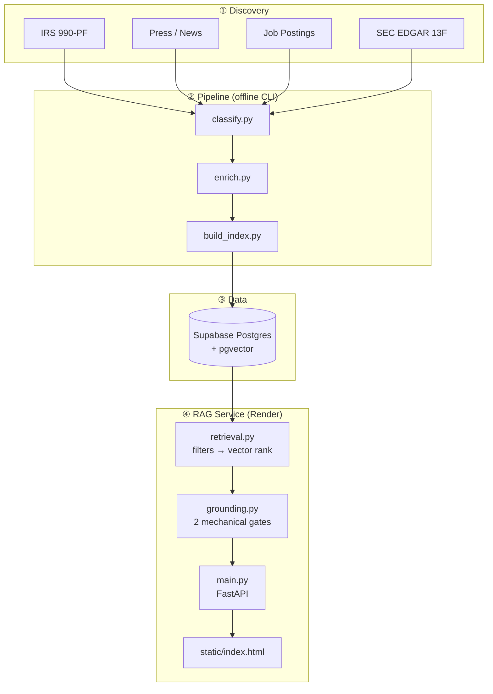

<div align="center">

# POLARITY iQ — Family Office Intelligence

**Sourced intelligence on 53 qualified US family offices — verified, inferred, or explicitly unavailable.**

<br/>

[](https://polarity-family-office-rag.onrender.com/)
[](https://python.org)
[](https://fastapi.tiangolo.com)
[](https://postgresql.org)
[](https://github.com/pgvector/pgvector)
[](https://supabase.com)
[](https://openai.com)
[](https://render.com)

<br/>

🔗 **Live app:** [https://polarity-family-office-rag.onrender.com/](https://polarity-family-office-rag.onrender.com/)

</div>

---

## What this is

An end-to-end pipeline that **discovers**, **classifies**, **enriches**, and **serves** intelligence on US family offices — with a grounded RAG chat interface on top.

Every answer is tied to **sourced claims** (one field, one source, one verification status). The system refuses, qualifies, or corrects false premises rather than improvising.

| | |
|---|---|
| **Qualified firms** | 53 (42 single-family · 11 multi-family) |
| **Claims indexed** | ~475 claim-level chunks |
| **States covered** | 24 |
| **Contact data** | Masked in UI — gated for subscribers |

> This is a curated research dataset, not live market data. No national completeness claim.

---

## Architecture



### Layer separation (strict one-way imports)

| Module | Role | Must not import |
|---|---|---|
| `src/db.py` | Postgres connection | — |
| `src/rag/build_index.py` | Offline chunking + embeddings | grounding |
| `src/rag/retrieval.py` | NL filters → SQL → cosine rank | grounding, LLM chat |
| `src/rag/grounding.py` | Gate 1 + Gate 2 + cited answers | retrieval, db |
| `src/rag/main.py` | Thin API orchestration | business logic |
| `src/rag/static/` | Presentation only | retrieval logic |

**Gate 1** — refuse before LLM if zero claims or similarity too low.  
**Gate 2** — strip any generated sentence citing a claim not in the retrieved set.

---

## Pipeline stages

### 1 · Discovery
Four independent source classes — each finds firms the others miss:

| Source | Finds | Blind spot |
|---|---|---|
| IRS 990-PF | Families via charitable foundations | No foundation / separated entity |
| Press / news | Offices in the news | Deliberately quiet offices |
| Job postings | Offices actively hiring | Stable, no-hire teams |
| SEC EDGAR 13F | Managers with $100M+ in US-listed equities (legal filing obligation) | Offices below threshold, or holding mostly private/non-13F assets |

> **13F is not AUM.** Filed values cover 13F-reportable US-listed positions only — never equated to total assets in this pipeline.

### 2 · Classification
Multi-evidence gate (E1 page attestation, E2 surname, E6 press/job confirmation).  
SEC Form ADV used for **exclusion only** — absence corroborates SFO status, never proves it alone.

### 3 · Enrichment
Principals, SMTP-verified emails, profile fields (thesis, sectors, AUM), dated signals.  
Blanks beat guesses — `NOT AVAILABLE` is a first-class outcome.

### 4 · RAG index
One **claim per field per firm** (~8 chunks/firm), including **negative claims** ("AUM is NOT AVAILABLE — do not estimate").  
Embeddings: `text-embedding-3-small` · Answers: `gpt-5.1`

### 5 · Validation
**Layer 1 (dataset):** random sample hand-checked against `classification_source_url`.  
8/53 records verified 2026-07-28 — 100% firm identity precision, 4 field errors found and corrected.  
Details: [`docs/validation_layer1.md`](docs/validation_layer1.md)

**Layer 2 (RAG):** adversarial query suite — `python src/rag/query_test.py --suite`

---

## Quick start (local)

**Prerequisites:** Python 3.11+, Supabase Postgres with pgvector, OpenAI API key

```bash
git clone https://github.com/thisisahmad/polarity-family-office-rag.git
cd polarity-family-office-rag

python -m venv .venv && .venv\Scripts\activate   # Windows
pip install -r requirements.txt

# .env — minimum for the web service
# DATABASE_URL=postgresql://...
# OPENAI_API_KEY=sk-...
# ANSWER_MODEL=gpt-5.1

# Build claim index (offline, run once after enrichment)
python src/rag/build_index.py

# Run locally
uvicorn src.rag.main:app --host 0.0.0.0 --port 8000
# → http://localhost:8000
```

### Evaluation

```bash
python src/rag/query_test.py "Which single-family offices are in Texas?"
python src/rag/query_test.py --suite    # → data/eval_layer2_results.json
```

---

## API

| Method | Path | Description |
|---|---|---|
| `GET` | `/` | Chat UI |
| `GET` | `/health` | Liveness (no DB, no OpenAI) |
| `POST` | `/api/search` | Grounded search `{ "query": "..." }` |
| `GET` | `/api/firm/{id}` | Full claim card for a firm |
| `GET` | `/api/stats` | Dataset coverage stats |

---

## Project structure

```
src/
├── discovery/          # 990-PF, press, jobs, EDGAR 13F sources
├── classify/           # Multi-evidence firm qualification
├── enrich/             # Principals, SMTP verify, profiles, signals
├── export/             # CSV dataset exporter
├── rag/
│   ├── build_index.py  # Offline: claims + embeddings
│   ├── retrieval.py    # Filters first, rank second
│   ├── grounding.py    # Mechanical answer gates
│   ├── main.py         # FastAPI
│   ├── query_test.py   # Eval harness
│   └── static/         # Glass-morphism chat UI
└── db.py               # Postgres connection
```

---

## Deployment

Hosted on **[Render](https://render.com)** (Python free tier) — single process serves UI + API.

```
Build:  pip install -r requirements.txt
Start:  uvicorn src.rag.main:app --host 0.0.0.0 --port $PORT
```

Env vars: `DATABASE_URL` · `OPENAI_API_KEY` · `ANSWER_MODEL`

---

## Design decisions

Full rationale — source tradeoffs, schema choices, RAG architecture, adversarial testing, deployment pivots — is in **[DECISION_LOG.md](./DECISION_LOG.md)**.

---

## Known limitations

- **Coverage:** 53 firms is a defensible subset, not the US market
- **Cold start:** Render free tier spins down after 15 min idle (~40s first load)
- **Contact data:** Emails masked server-side; verification status visible, addresses gated
- **AUM:** Only stated when a source explicitly provides it — 13F filings are never treated as AUM

---

<div align="center">

Built for **Polarity iQ** · Family office intelligence with mechanical grounding

</div>
